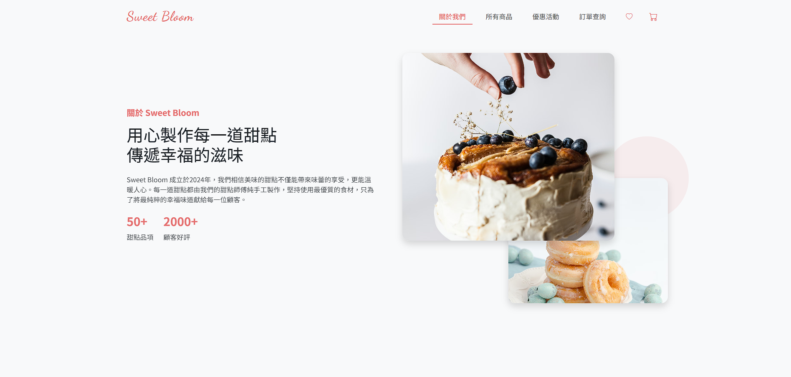
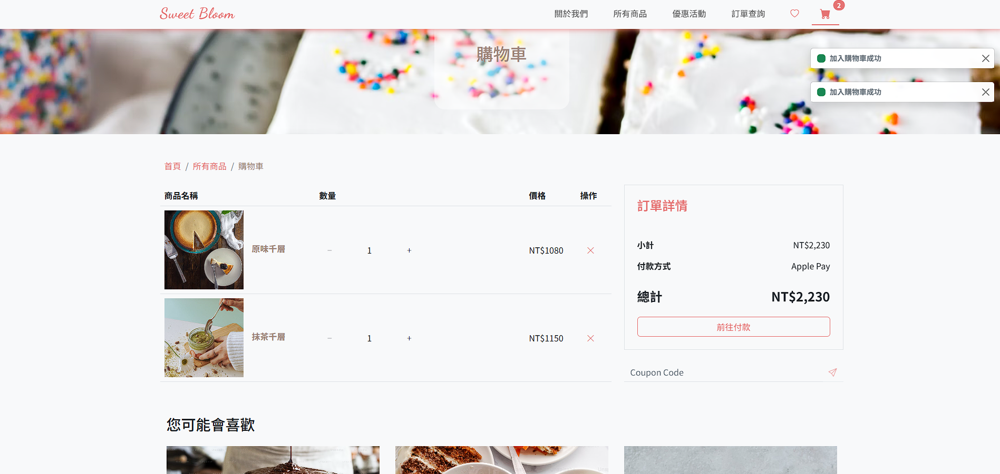
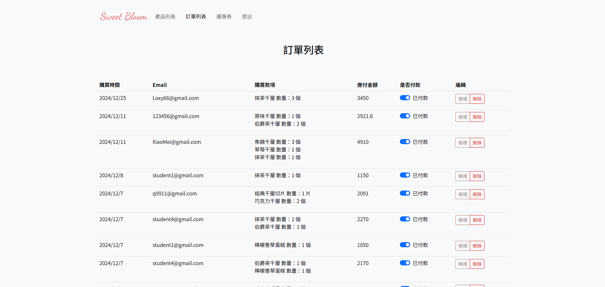

# Sweet Bloom - Dessert E-commerce

## 💻 Demo
[Website Demo](https://darren901.github.io/sweet-bloom/)

## 🎯 關於 Sweet Bloom
甜點電商網站，提供完整的購物體驗，從商品瀏覽、購物車管理到訂單結帳的一站式服務，並具備後台管理系統。

## ✨ Features
### 前台功能
- 商品展示與分類搜尋
- 購物車系統
- 優惠券套用
- 會員訂單管理
- 商品收藏清單

### 後台功能
- 商品上架與管理
- 訂單處理系統
- 優惠券管理
- 後台登入驗證

## 🛠 Technologies
### Framework & Libraries
- Vue.js 
- Vue Router
- Pinia (狀態管理)
- Bootstrap 5 & SCSS

### Features & Optimization
- Vee Validate (表單驗證)
- Vue Loading Overlay (載入動畫)
- AOS (頁面滾動動畫)
- Axios (API 串接)

## 📱 Screenshots

## 🎨 UI/UX 設計重點
- 響應式設計，完美支援各種裝置
- 精心設計的動畫效果，提升使用體驗
- 直覺的購物流程
- 清晰的後台管理介面
